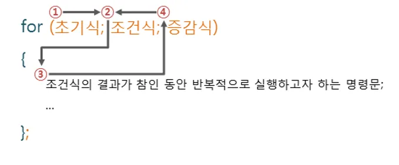

# 📝 Week 03 Notes

> 강의: 스스로 프로그래밍하는 능력을 키우는 C++  
> 날짜: 2025년 08월 17일  
> 주제: 조건문의 다중 비교, for문

---

## 🎯 학습 목표

- [ ] 조건문의 다중비교 이해 및 활용
- [ ] 반복문 기초와 패턴 출력 능력 향상
- [ ] 입출력과 변수 연산 활용 능력 강화

---

## 📌 핵심 개념 정리

### 📍 논리 연산자

```
💡 논리 연산자는 주어진 논리식을 판단하여, 참 또는 거짓을 결정하는 연산자이다.
AND 연산자와 OR 연산은 두 개의 피연산자를 가지는 이항 연산자이며, 피연산자들의 결합 방향은 왼쪽에서 오른쪽이다.
```

| 논리 연산자 | 설명                                        |
|:------:|-------------------------------------------|
|  `&&`  | 논리식이 모두 참이면 1을 반환함. (논리 AND 연산)           |
| `\|\|` | 논리식 중에서 하나라도 참이면 1을 반환함. (논리 OR 연산)       |                                          | |`                                         | 'A'                                       |
|  `!`   | 논리식의 결과가 참이면 0을, 거짓이면 1일 반환함. (논리 NOT 연산) |

```cpp
#include <iostream>

int main()
{
	int a = -1;
	if (a < 3)
	{
		if (a > 0)
		{
			std::cout << "가독성이 안좋다";
		}
	}

	// 논리 연산자
	if (a < 3 && a > 0)
	{
		// 조건을 3개이상 사용하는 것보다
		// if문을 하나 더 추가하는게 가독성이 좋다.
		//if (a != 0)
		//{

		//}
		
		// && AND 연산자 : 두 조건 다 참일 때 참을 반환
		std::cout << "AND 연산자";
	}

	if (a < 3 || a > 0)
	{
		// || OR 연산자 : 두 조건 중 하나만 참이어도 참을 반환
		std::cout << "OR 연산자";
	}

	return 0;
}
```

---

### 📍 else if 문

- if 문 연결하기, if-else 문을 함께 연결할 수 있다.

```cpp
#include <iostream>

int main()
{
    std::cout << "Enter a number: ";
    int x;
    std::cin >> x;

    if (x > 10)
        std::cout << x << "is greater than 10\n";
    else if (x < 10)
        std::cout << x << "is less than 10\n";
    else
        std::cout << x << "is exactly 10\n";

    return 0;
}
```

---

### 📍 for 반복문

- 반복문이란 프로그램 내에서 똑같은 명령을 일정 횟수만큼 반복하여 수행하도록 제어하는 명령어 입니다.
- 프로그램이 처리하는 대부분의 코드는 반복적인 형태가 많으므로, 가장 많이 사용하는 문법중 하나이다.



- `"Hello World\n"`를 10번 반복해서 출력하는 소스코드.

```cpp
#include <iostream>

int main()
{
	// 증가 반복문
	int a = 0;
	for (a = 0; a < 10; a++) 
	{
		std::cout << a;
	}
	
	for (a = 0; a < 10; a+=2) 
	{
		std::cout << a;
	}


	// 감소 반복문
	for (int i = 9; i > 0; i--) 
	{
		std::cout << i;
	}
	return 0;
}
```

---

## 💡 배운 점 & 느낀 점

- 조건문 순서와 중첩 구조를 잘 설계해야 불필요한 코드 실행을 줄일 수 있다.
- `for`문에서 시작값, 종료값, 증감값을 조절하면 역순, 구간 출력, 증가/감소 패턴 등을 쉽게 구현할 수 있다.

---

## 🧠 미해결 질문 / 추가 복습 필요 항목

- [ ] 잘못된 구문(`if (a == 1, b == 2)`)의 동작 원리와 복잡한 조건문에서 우선순위와 괄호 사용 연습이 필요하다고 느꼈다.
- [ ] 반복문과 조건문을 결합하여 출력 패턴을 정확하게 제어하는 방법과 중첩 반복문 활용, 반복문 내 변수 조정에 대한 이해가 필요하다고 느꼈다.

---

## ✅ 실습 문제 정리

- 숙제 연습문제

|   문제 번호   |       문제 이름        | 풀이 여부 |
|:---------:|:------------------:|:-----:|
| problem01 | 숫자 크기 비교로 메시지 출력하기 |   ✅   |
| problem02 |  두 수 비교하여 큰 값 찾기   |   ✅   |
| problem03 |  특정 값(5 또는 10) 판별  |   ✅   |
| problem04 | 두 값이 모두 특정 값인지 판별  |   ✅   |
| problem05 | for문을 이용한 3~10 출력  |   ✅   |
| problem06 |   입력받은 구간의 정수 출력   |   ✅   |
| problem07 |   문자열 25번 반복 출력    |   ✅   |
| problem08 |    입력값만큼 ## 출력     |   ✅   |
| problem09 |   10부터 1까지 역순 출력   |   ✅   |
| problem10 |  Magic 출력 조건문 예제   |   ✅   |
| problem11 |    0부터 N까지 출력하기    |   ✅   |
| problem12 |   세 수의 합과 곱 비교하기   |   ✅   |
| problem13 | 합이 10 초과일 때 곱 출력하기 |   ✅   |
| problem14 |   카운트다운 발사 프로그램    |   ✅   |
| problem15 |   -5부터 5까지 출력하기    |   ✅   |

- 복습 문제

|  문제 번호   |            문제 이름            | 풀이 여부 |
|:--------:|:---------------------------:|:-----:|
| review01 |        3부터 8까지 출력하기         |   ✅   |
| review02 |        숫자 3줄 반복 출력하기        |   ✅   |
| review03 |     잘못된 조건문으로 로그인 검증하기      |   ✅   |
| review04 |      입력값 기반 숫자 증가 출력하기      |   ✅   |
| review05 |    a와 b+c 비교하여 최대값 판단하기     |   ✅   |
| review06 |      곱을 기준으로 사이즈 분류하기       |   ✅   |
| review07 |       입력값부터 감소하며 출력하기       |   ✅   |
| review08 |       입력값 범위별 숫자 출력하기       |   ✅   |
| review09 |     두 값 연속 출력하며 역순 반복하기     |   ✅   |
| review10 |         홀수 연속 출력하기          |   ✅   |
| review11 |      반복문 시작과 종료 표시 출력       |   ✅   |
| review12 |   반복문으로 패턴 출력하기 (##와 @@)    |   ✅   |
| review13 | 횟수 표시하며 반복 출력하기 (1~5번 go!!) |   ✅   |
| review14 |     ID와 비밀번호로 로그인 검증하기      |   ✅   |
| review15 |       입력값부터 0까지 역순 출력       |   ✅   |

---

## 🔗 참고 자료

- [스스로 프로그래밍 하는 능력을 키우는 C++](https://typical-slug-3ef.notion.site/LV03-for-93d796db617f489fb6fea1ce430b70d7)
- [C++ 03.06 - 논리 연산자 (Logical operators)](https://boycoding.tistory.com/162)

---