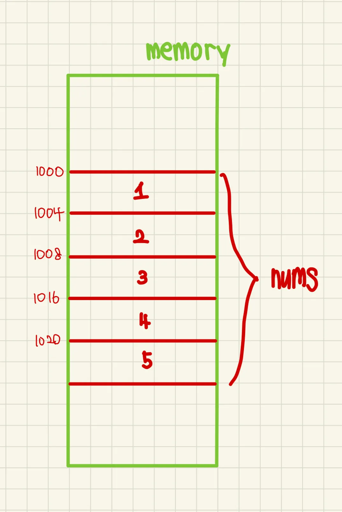

# 📝 Week 04 Notes

> 강의: 스스로 프로그래밍하는 능력을 키우는 C++  
> 날짜: 2025년 08월 24일  
> 주제: 배열

---

## 🎯 학습 목표

- [ ] 배열의 기본 개념과 메모리 구조(시작 주소, 원소 크기)를 이해한다.
- [ ] 인덱스를 이용해 배열 요소에 안전하게 접근하고, 범위 벗어남(Out of Bounds)의 위험성을 인지한다.
- [ ] 반복문과 배열을 결합하여 효율적으로 데이터를 처리하는 방법을 익힌다.

---

## 📌 핵심 개념 정리

### 📍 배열 (Array)

- **배열(Array)** 이란 같은 데이터 타입의 변수들이 모인 **집합**이다.
- 배열은 **연속된 메모리** 공간에 저장되며, 각 요소는 동일한 크기를 가진다.
- 배열은 다음 두 가지 요소로 구성된다.

| 배열 구성 요소  |          	의미           |
|:---------:|:----------------------:|
| 배열의 시작 주소 | 	배열이 메모리에서 시작하는 위치의 주소 |
| 배열 원소 크기	 |  각 원소가 메모리에서 차지하는 크기   |

---

### 📍 배열과 인덱스(Index)

- 배열에서 각 요소에 접근할 때는 **인덱스(index)** 를 사용한다.
- 인덱스는 배열의 시작 주소를 기준으로 각 데이터의 시작 주소를 계산하기 위해 사용된다.
- 배열의 인덱스가 **0부터 시작**하는 이유는 다음과 같은 주소 계산 방식을 사용하기 때문이다.



---

### 📍 주소 계산 예시 (정수형 배열)

| 값 |     	시작 주소     | 	인덱스 |
|:-:|:--------------:|:----:|
| 1 | 	1000 + 4 × 0  |  	0  |
| 2 | 	1000 + 4 × 1	 |  1   |
| 3 | 	1000 + 4 × 2	 |  2   |
| 4 | 	1000 + 4 × 3	 |  3   |
| 5 | 	1000 + 4 × 4	 |  4   | 

- 위 표에서 볼 수 있듯이, **시작 주소 + (자료형 크기 × 인덱스)** 로 원하는 요소의 주소를 빠르게 찾을 수 있다.

---

### 📍배열 기본 사용법 및 초기화 예시

```c++
#include <iostream>

int main()
{
    int arr[5] = { 1, 2, 3, 4, 5 };
    // int형 배열 arr를 선언 및 초기화. 크기는 5이며, 값은 1,2,3,4,5

    return 0;
}
```

---

### 📍배열 요소 접근 예시

```c++
#include <iostream>

int main()
{
    int arr[5] = { 1, 2, 3, 4, 5 };

    // 배열의 첫 번째 요소에 접근 (인덱스는 0부터 시작)
    std::cout << arr[0]; // 출력: 1

    // 잘못된 인덱스 접근 예시
    int index = 5;
    std::cin >> index;
    std::cout << arr[index]; // 0~4를 벗어나면 지정되지 않은 값 (위험)

    return 0;
}
```

> ⚠️ 주의: 배열의 인덱스가 범위를 벗어나면 정의되지 않은 동작이 발생할 수 있다.

---

### 📍배열과 반복문의 활용

- 배열은 반복문과 결합하면 매우 효율적인 처리를 할 수 있다.

```c++
#include <iostream>

int main()
{
    int arr[5] = { 1, 2, 3, 4, 5 };

    for (int i = 0; i < 5; i++)
    {
        std::cout << arr[i]; // i를 배열의 인덱스로 사용
    }

    return 0;
}
```

> ✅ 출력 결과: `12345`

---

## 💡 배운 점 & 느낀 점

- 배열은 같은 타입의 데이터를 연속된 메모리 공간에 저장하고, 인덱스를 통해 빠르게 접근할 수 있다는 점을 이해했다.
- 인덱스가 0부터 시작하는 이유와 주소 계산 방식(시작 주소 + 자료형 크기 × 인덱스)을 명확히 알게 되었다.

---

## 🧠 미해결 질문 / 추가 복습 필요 항목

- [ ] 배열의 크기를 실행 중 동적으로 변경하는 방법과 동적 메모리 할당(new, delete)의 필요성
- [ ] 다차원 배열(2차원, 3차원)의 메모리 구조와 인덱스 계산 방식

---

## ✅ 실습 문제 정리

- 숙제 연습문제

|   문제 번호   |         문제 이름          | 풀이 여부 |
|:---------:|:----------------------:|:-----:|
| problem01 |    5개의 숫자 입력받아 출력하기    |   ✅   |
| problem02 |     배열에서 인덱스로 값 찾기     |   ✅   |
| problem03 | 배열의 첫 번째와 마지막 요소 합 구하기 |   ✅   |
| problem04 |   입력값 기반 배열 초기화 및 출력   |   ✅   |
| problem05 |  배열에서 두 인덱스 값의 합 구하기   |   ✅   |
| problem06 |       배열 값 조건 판단       |   ✅   |
| problem07 |      배열 값 조작 후 출력      |   ✅   |
| problem08 |     조건에 따른 반복문 실행      |   ✅   |
| problem09 |                        |  🔄   |
| problem10 |                        |  🔄   |
| problem11 |                        |  🔄   |
| problem12 |                        |  🔄   |

- 복습 문제

|  문제 번호   | 문제 이름 | 풀이 여부 |
|:--------:|:-----:|:-----:|
| review01 |       |  🔄   |
| review02 |       |  🔄   |
| review03 |       |  🔄   |
| review04 |       |  🔄   |
| review05 |       |  🔄   |
| review06 |       |  🔄   |
| review07 |       |  🔄   |
| review08 |       |  🔄   |
| review09 |       |  🔄   |

---

## 🔗 참고 자료

- [스스로 프로그래밍 하는 능력을 키우는 C++](https://typical-slug-3ef.notion.site/LV04-bfa16f6b70a540fd8779706fc41fbbce)
- [C++ 07.21 - std::array 소개](https://boycoding.tistory.com/213)

---