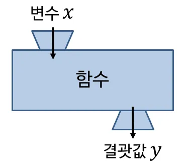

# 📝 Week 05 Notes

> 강의: 스스로 프로그래밍하는 능력을 키우는 C++  
> 날짜: 2025년 08월 31일  
> 주제: char, 함수, 지역변수, 전역변수

---

## 🎯 학습 목표

- [ ]  `char`와 `char 배열`의 차이와 사용법을 이해하고, 문자열 끝을 나타내는 `'\0'`의 중요성을 설명할 수 있다.
- [ ] 함수를 선언, 정의, 호출하는 방법을 익히고, 반환값 있는 함수와 없는 함수(`void`)의 차이를 구분할 수 있다.
- [ ] 지역변수와 전역변수의 범위, 수명, 메모리 사용 차이를 이해하고, 적절한 변수 사용 방법을 선택할 수 있다.

---

## 📌 핵심 개념 정리

### 📍 문자형 변수 `char`

- 크기 : `1 byte`
- 역할 : 단 하나의 문자만 저장 가능

```c++
char ch = 'A'; // 올바른 예시
// char ch2 = "A"; // 틀린 예시: 큰따옴표("")는 문자열에 사용
```

---

### 📍 문자형 배열 (`char 배열`) 주의점

#### 1️⃣ 여러 문자를 저장하려면 배열을 써야 한다.

```c++
char str[5]; // 크기가 5인 문자 배열 생성
str[0] = 'A';
str[1] = 'B';
str[2] = 'C';
str[3] = 'D';
str[4] = 'E';
```

#### 2️⃣ 문자열 끝을 나타내는 널(null) 문자 `'\0'`를 꼭 써야 한다.

- `'\0'`는 문자열의 끝을 표시하는 특수 문자입니다.

##### ***올바른 문자열 예시***

```c++
char str2[6] = "HELLO";
// 자동으로 마지막에 '\0'가 추가됨.
// [H][E][L][L][O][\0]
```

##### ***주의***

```c++
char str[5] = {'A', 'B', 'C', 'D', 'E'};
// '\0'이 없음. 문자열로 출력하면 끝을 찾을 수 없어 이상한 문자까지 출력됨.
```

---

### 📍함수란?



- 특정 기능을 수행하는 **코드의 묶음(집합)** 이다.
- 코드 반복을 줄이고 가독성을 높일 때 사용된다.

**장점 :**

- **반복성** 감소
- **가독성** 향상
- 코드 재사용 용이

---

### 📍함수 사용법 (예시)


#### ✅ 함수 선언과 사용

```c++
#include <iostream>

// 선언과 정의를 한번에
int Add(int a, int b) {
	return a + b;
}

int main() {
	int sum = Add(10, 5); // 함수 호출
	std::cout << sum;      // 출력 : 15
	return 0;
}
```

---

#### ✅ 반환값 없는 함수 (`void`)

```c++
#include <iostream>

void print() {
	std::cout << "안녕하세요";
}

int main() {
	print();  // 호출
	print();  // 호출
	return 0;
}
// 출력 : 안녕하세요안녕하세요
```

---

#### ✅ 함수 선언과 정의 분리

```c++
#include <iostream>

void test(); // 선언 (함수가 있다는 것을 알림)

int main() {
	test(); // 호출
	return 0;
}

// 정의 (함수 내용 작성)
void test() {
	std::cout << "ABCD";
}
```

---

### 📍지역변수(Local Variable)

- 특정 함수 안에서만 유효한 변수이다.
- 함수가 종료되면 자동 소멸한다.

**예시 코드**

```c++
#include <iostream>

void test(int a) {
	a += 50;
	std::cout << a; // 150 출력
}

int main() {
	int a = 100; // 지역변수 a
	test(a);

	std::cout << a; // 원래 a 값인 100 출력
	return 0;
}
```

---

### 📍전역변수(Global Variable)

- 프로그램 전체에서 접근 가능한 변수이다.
- 프로그램이 종료될 때까지 메모리에 존재한다.
- 남발하면 메모리 낭비가 심해져 성능을 저하시킨다.

**예시 코드**

```c++
#include <iostream>

int a = 0; // 전역변수

void test() {
	a += 50;
	std::cout << a; // 150 출력
}

int main() {
	a = 100;
	test();

	std::cout << a; // 150 출력 (전역변수의 값이 바뀌었기 때문)
	return 0;
}
```

---

### ⚖️ 지역변수 vs 전역변수 비교

|   구분   |   	지역변수	    |      전역변수      |
|:------:|:-----------:|:--------------:|
|  범위	   | 해당 함수 내에서만  |    	모든 함수에서    |
|  수명	   | 함수 종료 시 소멸	 | 프로그램 종료 시까지 유지 |
| 메모리 사용 |    	효율적	    |  비효율적 (남발 시)   |
|  사용처   |  	대부분의 변수   | 	꼭 필요한 공통 데이터  |

---

### ✅ 결론과 사용법 권장사항

- 초보 단계의 공부나 작은 숙제는 전역변수 사용이 편리할 수 있다. 많이 사용하자.
- **실제 프로젝트**에서는 전역변수를 **최소한으로 사용**하고, 가능하면 **지역변수나 전달인자**로 해결하는 습관을 가지는 게 좋다.

---

## 💡 배운 점 & 느낀 점

- `char`는 단일 문자만 저장하고, 문자열은 `char 배열과 `'\0'`로 끝을 표시해야 한다는 점을 배웠다.
- 함수를 사용하면 코드 반복을 줄이고 가독성을 높일 수 있으며, 지역변수와 전역변수의 차이를 이해하면 변수 사용 범위를 효율적으로 관리할 수 있다는 것을 느꼈다.

---

## 🧠 미해결 질문 / 추가 복습 필요 항목

- [ ] 문자열 끝을 나타내는 `'\0'`을 직접 선언할 때와 자동으로 추가될 때의 차이 실습
- [ ] 전역변수 남발 시 발생할 수 있는 성능 문제와 실제 프로젝트에서 최소화하는 방법 이해

---

## ✅ 실습 문제 정리

- 숙제 연습문제

|   문제 번호   |       문제 이름        | 풀이 여부 |
|:---------:|:------------------:|:-----:|
| problem01 | 문자 3번 출력하기 (함수 활용) |   ✅   |
| problem02 |   배열 입력 후 합계 출력    |   ✅   |
| problem03 |   배열 인덱스로 문자 출력    |   ✅   |
| problem04 |    조건에 따른 함수 호출    |   ✅   |
| problem05 |     LOT 함수 호출      |   ✅   |
| problem06 |    함수로 특수문자 출력     |   ✅   |
| problem07 |      배열 값 채우기      |   ✅   |
| problem08 |    전역 변수와 함수 호출    |   ✅   |
| problem09 |   배열 출력 함수 반복 호출   |   ✅   |
| problem10 |   배열 입력 후 역순 출력    |   ✅   |
| problem11 |    연속된 수 배열 출력     |   ✅   |
| problem12 |    배열 합으로 함수 호출    |   ✅   |
| problem13 |                    |  🔄   |

- 복습 문제

|  문제 번호   | 문제 이름 | 풀이 여부 |
|:--------:|:-----:|:-----:|
| review01 |       |  🔄   |
| review02 |       |  🔄   |
| review03 |       |  🔄   |
| review04 |       |  🔄   |
| review05 |       |  🔄   |
| review06 |       |  🔄   |
| review07 |       |  🔄   |
| review08 |       |  🔄   |
| review09 |       |  🔄   |
| review10 |       |  🔄   |
| review11 |       |  🔄   |
| review12 |       |  🔄   |
| review13 |       |  🔄   |
| review14 |       |  🔄   |

---

## 🔗 참고 자료

- [스스로 프로그래밍 하는 능력을 키우는 C++](https://typical-slug-3ef.notion.site/LV05-Char-9c82cf2fe4164cc8938ba7aef6f8dd07)
- [C++ 01.04 - 함수와 반환 값 (functions and return values)](https://boycoding.tistory.com/138)

---