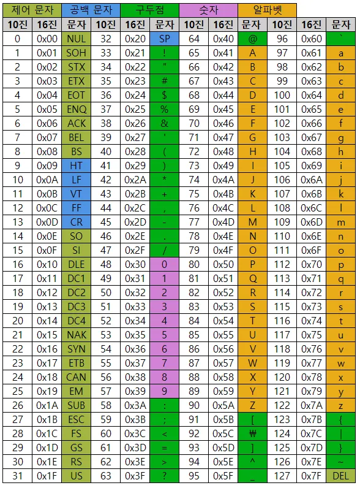

# 📝 Week XX Notes

> 강의: 스스로 프로그래밍하는 능력을 키우는 C++  
> 날짜: 2025년 09월 05일  
> 주제: ASCII 코드, 2중 for문

---

## 🎯 학습 목표

- [ ] ASCII 코드의 개념과 문자 ↔ 숫자 변환 원리를 이해한다.
- [ ] 대문자/소문자, 숫자 구분 조건문을 작성할 수 있다.
- [ ] 자료형 변환(C 스타일, C++ 스타일 static_cast)의 차이와 활용법을 익힌다.
- [ ] 2중 for문(중첩 반복문)의 구조와 동작 방식을 이해한다.

---

## 📌 핵심 개념 정리

### 📍 ASCII 코드란?



- 컴퓨터는 문자를 직접 저장할 수 없기 때문에, **문자를 숫자로 변환**하여 저장합니다.
- 이때 사용하는 표준 문자-숫자 매핑을 **ASCII 코드**라고 합니다.

|     문자      | ASCII 코드 (10진수) |
|:-----------:|:---------------:|
| `'A'`~`'Z'` |     65 ~ 90     |
| `'a'`~`'z'` |    97 ~ 122     |
| `'0'`~`'9'` |     48 ~ 57     |

**예시:**

- `'A'` → ASCII `65`
- `'a'` → ASCII `97`

---

### 📍 대소문자 구분 방법

- ASCII 코드 상에서 대문자와 소문자는 32만큼 차이가 납니다.

|  문자   | ASCII 값 |
|:-----:|:-------:|
| `'A'` |   65    |
| `'a'` |   97    |
|  차이   |   32    |

- **대문자를 소문자로** 변환하려면 `+32`
- **소문자를 대문자로** 변환하려면 `32`

**예시:**

```c++
char uppercase = 'A';
char lowercase = uppercase + 32; // 'a' 가 된다.
```

---

### 📍 예제: 대/소문자, 숫자 구분하기

```c++
#include <iostream>

int main()
{
	char ch;
	std::cin >> ch;

	if (ch >= 'A' && ch <= 'Z') {
		std::cout << "대문자";
	}
	else if (ch >= 'a' && ch <= 'z') {
		std::cout << "소문자";
	}
	else if (ch >= '0' && ch <= '9') {
		std::cout << "숫자";
	}

	return 0;
}
```

**실행 예시:**

```c++
입력 : A
출력 : 대문자

입력 : f
출력 : 소문자

입력 : 5
출력 : 숫자
```

---

### 📍 자료형 변환 (Type Casting)

- 변수의 자료형을 일시적으로 다른 자료형으로 바꾸는 방법입니다.
- **C 방식과 C++ 방식**으로 구분할 수 있습니다.

#### ✅ C 스타일 형변환

```c++
(char)정수값;  // 정수 → 문자로 변환
(int)문자;    // 문자 → 정수로 변환
```

#### ✅ C++ 스타일 형변환 (`static_cast)

```c++
static_cast<char>(정수값); // 정수 → 문자로 변환
static_cast<int>(문자);    // 문자 → 정수로 변환
```

**예제 코드**

```c++
#include <iostream>

int main()
{
	char ch = 'A';

	// 문자를 숫자로 변환 (ASCII 코드 값 출력)
	std::cout << (int)ch << std::endl;             // 65 (C 스타일)
	std::cout << static_cast<int>(ch) << std::endl; // 65 (C++ 스타일)

	// 숫자를 문자로 변환
	int num = 65;
	std::cout << (char)num << std::endl;             // A (C 스타일)
	std::cout << static_cast<char>(num) << std::endl; // A (C++ 스타일)

	return 0;
}
```

**출력 결과:**

```c++
65
65
A
A
```

---

### 📍2중 for문 예제 (중첩 for문)

- for문 안에 또 다른 for문이 들어간 형태를 2중 for문이라 합니다.

**예시 코드**

```c++
#include <iostream>

int main()
{
	for (int j = 0; j < 3; j++) // 바깥 반복문 (3번 반복)
	{
		for (int i = 0; i < 3; i++) // 안쪽 반복문 (3번 반복)
		{
			std::cout << "Hello World!" << std::endl;
		}
		std::cout << "=====================" << std::endl;
	}

	return 0;
}
```

**출력 결과:**

```c++
Hello World!
Hello World!
Hello World!
=====================
Hello World!
Hello World!
Hello World!
=====================
Hello World!
Hello World!
Hello World!
=====================
```

---

## 💡 배운 점 & 느낀 점

- `static_cast` 같은 C++ 스타일 형변환이 더 안전하고 권장된다는 점을 배웠다.
- 2중 for문을 통해 반복 구조를 제어하는 방법을 실습하면서 코드 흐름을 더 잘 이해할 수 있었다.

---

## 🧠 미해결 질문 / 추가 복습 필요 항목

- [ ] ASCII 외에 유니코드(UTF-8) 문자 처리
- [ ] `static_cast`, `reinterpret_cast`, `dynamic_cast`의 차이점

---

## ✅ 실습 문제 정리

- 숙제 연습문제

|   문제 번호   |          문제 이름          | 풀이 여부 |
|:---------:|:-----------------------:|:-----:|
| problem01 | 함수 호출을 이용한 문자 입력 및 출력하기 |   ✅   |
| problem02 | 문자 입력 후 ASCII 코드 값 출력하기 |   ✅   |
| problem03 |   n줄 동안 1부터 5까지 출력하기    |   ✅   |
| problem04 |    문자와 ASCII 코드 출력하기    |   ✅   |
| problem05 |      배열 문자 반복 출력하기      |   ✅   |
| problem06 |      문자 대소문자 판별하기       |   ✅   |
| problem07 |       정사각형 # 출력하기       |   ✅   |
| problem08 |    문자 → 숫자 변환 후 계산하기    |   ✅   |
| problem09 |    A부터 입력 문자까지 출력하기     |   ✅   |
| problem10 |      문자를 대문자로 변환하기      |   ✅   |
| problem11 |    두 문자 사이의 알파벳 출력하기    |   ✅   |
| problem12 |         ABC 찾기          |   ✅   |
| problem13 |                         |  🔄   |

- 복습 문제

|  문제 번호   | 문제 이름 | 풀이 여부 |
|:--------:|:-----:|:-----:|
| review01 |       |  🔄   |
| review02 |       |  🔄   |
| review03 |       |  🔄   |
| review04 |       |  🔄   |
| review05 |       |  🔄   |
| review06 |       |  🔄   |
| review07 |       |  🔄   |
| review08 |       |  🔄   |
| review09 |       |  🔄   |
| review10 |       |  🔄   |
| review11 |       |  🔄   |

---

## 🔗 참고 자료

- [스스로 프로그래밍 하는 능력을 키우는 C++](https://typical-slug-3ef.notion.site/LV06-ASCII-2-for-b31c29fe7376474cabaf4e291183f1d9)
- [컴퓨터 시스템 훑어보기](https://boycoding.tistory.com/232)

---