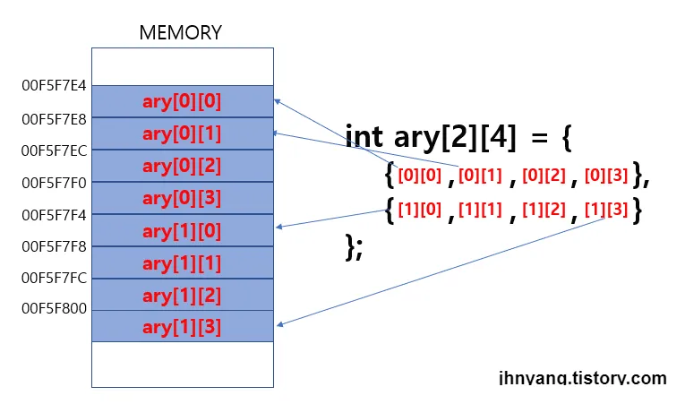

# 📝 Week XX Notes

> 강의: 스스로 프로그래밍하는 능력을 키우는 C++  
> 날짜: 2025년 09월 12일  
> 주제: 2차원 배열, 나머지 연산자, 카운팅

---

## 🎯 학습 목표

- [ ] 이중 반복문(Nested Loops)의 구조와 동작 원리를 이해하고, 다양한 패턴 출력에 적용할 수 있다.
- [ ] 2차원 배열 선언, 접근, 값 변경 방법을 익히고 이중 반복문과 함께 활용할 수 있다.
- [ ] 나머지 연산자 %를 활용하여 홀수/짝수, 배수 판별 등의 조건문을 작성할 수 있다.
- [ ] 배열 내 조건에 맞는 데이터 개수를 세는 로직(카운팅)을 작성할 수 있다.

---

## 📌 핵심 개념 정리

### 📍 이중 반복문 (Nested Loops)

- 단순한 작업의 반복을 넘어, 복잡하고 다차원적인 작업을 수행해야 할 때 이중 반복문이 사용됩니다. 이중 반복문은 **바깥쪽 반복문이 한 번 실행될 때, 안쪽 반복문은 처음부터 끝까지 모두 실행되는 구조**를
  가집니다.
- 시계의 분침과 초침을 생각하면 쉽습니다. 분침(바깥쪽 반복문)이 한 칸 움직일 때마다, 초침(안쪽 반복문)은 60번을 모두 돌아야 합니다.

**기본 구조:**

```c++
#include <iostream>

int main() 
{
    // 바깥쪽 for문: j는 0, 1, 2 총 3번 반복합니다.
    for (int j = 0; j < 3; j++)
    {
        // 안쪽 for문: k는 0, 1, 2 총 3번 반복합니다.
        for (int k = 0; k < 3; k++)
        {
            // 이 구문은 바깥쪽 반복 1번에 대해 안쪽 반복 3번씩, 총 3 * 3 = 9번 실행됩니다.
            std::cout << "j: " << j << ", k: " << k << std::endl;
        }
        std::cout << "--- 바깥쪽 루프 1회 종료 ---" << std::endl;
    }
    return 0;
}
```

---

### 📍 구구단 출력하기

- **바깥쪽 반복문 (`i`):** 2단부터 9단까지, 단(Dan)을 결정합니다.
- **안쪽 반복문 (`j`):** 각 단에 곱해지는 수(1부터 9까지)를 결정합니다.

```c++
#include <iostream>int main() 
{
    // 2단부터 9단까지 반복
    for (int i = 2; i < 10; i++) 
    {
        // 새로운 단을 시작하기 전에 제목을 출력하고 한 줄 띄웁니다.
        std::cout << "\n--- " << i << "단 ---" << std::endl; 
        
        // 각 단에 1부터 9까지 곱하기
        for (int j = 1; j < 10; j++) 
        {
            // "i * j = (결과)" 형식으로 출력합니다.
            std::cout << i << " * " << j << " = " << i * j << std::endl;
        }
    }
    
    return 0;
}
```

---

### 📍 2차원 배열과 이중 반복문



- 2차원 배열은 행(row)과 열(column)으로 구성된, 마치 엑셀 시트나 표와 같은 형태의 데이터를 저장하는 구조입니다. 이러한 2차원 배열의 모든 요소에 접근하고 값을 처리할 때 이중 반복문이 매우 유용하게
  사용됩니다.

---

### 📍2차원 배열 선언과 접근

- 2차원 배열은 대괄호 []를 두 번 사용하여 타입 이름[세로크기][가로크기] 형태로 선언합니다. 수학의 행렬처럼 [y][x] 좌표로 생각하면 다루기 편리합니다.

```c++
#include <iostream>int main() 
{
    // int형 2차원 배열 선언 (세로 2, 가로 4)
    int arr[2][4] = 
    {
        {1, 2, 3, 4},  // 첫 번째 행 (y=0)
        {5, 6, 7, 8}   // 두 번째 행 (y=1)
    };

    // 주석으로 인덱스를 표현하면 다음과 같습니다.
    // int arr[y][x] = { 
    //    {[0][0], [0][1], [0][2], [0][3]},
    //    {[1][0], [1][1], [1][2], [1][3]} 
    // }

    // 특정 요소에 접근하기
    int y = 1;
    int x = 2;
    int num = arr[y][x]; // arr[1][2]의 값인 7을 변수 num에 저장

    std::cout << "arr[" << y << "][" << x << "]의 값은 " << num << "입니다." << std::endl; // 출력: 7

    return 0;
}
```

---

### 📍이중 반복문으로 2차원 배열 다루기

- 이중 반복문을 사용하면 2차원 배열의 모든 요소를 순차적으로 방문하여 값을 읽거나 변경할 수 있습니다.
- **바깥쪽 반복문:** 세로(행, y)를 제어합니다.
- **안쪽 반복문:** 가로(열, x)를 제어합니다.

```c++
#include <iostream>int main()
{
    int arr[2][5] =
    {
        { 1, 2, 3, 4, 5 },
        { 6, 7, 8, 9, 10 }
    };

    // 이중 for문을 사용하여 배열의 모든 값을 0으로 변경
    for (int y = 0; y < 2; y++) // 세로 크기만큼 반복 (0, 1)
    {
        for (int x = 0; x < 5; x++) // 가로 크기만큼 반복 (0, 1, 2, 3, 4)
        {
            arr[y][x] = 0;
        }
    }

    // 변경된 값을 확인하기 위해 다시 출력
    for (int y = 0; y < 2; y++)
    {
        for (int x = 0; x < 5; x++)
        {
            std::cout << arr[y][x] << " ";
        }
        std::cout << std::endl; // 한 행 출력이 끝나면 줄바꿈
    }

    return 0;
}
```

---

### 📍나머지 연산자(%)를 사용한 조건 판별

- `%` 연산자는 나눗셈의 **나머지**를 구하는 연산자입니다. 이를 `if` 조건문과 함께 사용하면 숫자가 홀수인지, 짝수인지, 또는 특정 수의 배수인지 쉽게 구분할 수 있습니다.
- `num % 2 == 0` : 2로 나눈 나머지가 0인가? → **짝수** 판별
- `num % 2 == 1` : 2로 나눈 나머지가 1인가? → **홀수** 판별
- `num % 3 == 0` : 3로 나눈 나머지가 0인가? → **3의 배수** 판별

```c++
#include <iostream>int main() 
{
    int num = 101;
    std::cout << "숫자 " << num << "은(는) " << std::endl;

    if ((num % 2) == 0) 
    {
        std::cout << " - 짝수입니다." << std::endl;
    }
    else 
    {
        std::cout << " - 홀수입니다." << std::endl;
    }

    if ((num % 3) == 0) 
    {
        std::cout << " - 3의 배수입니다." << std::endl;
    }
    else 
    {
        std::cout << " - 3의 배수가 아닙니다." << std::endl;
    }

    return 0;
}
```

---

### 📍배열 내 조건에 맞는 데이터 개수 세기 (카운팅)

1. 개수를 셀 변수(`count`)를 0으로 초기화합니다.
2. 반복문을 통해 배열의 모든 요소를 하나씩 확인합니다.
3. `if` 조건문을 사용하여 현재 요소가 원하는 조건에 맞는지 검사합니다.
4. 조건이 참이면 `count` 변수를 1 증가시킵니다.
5. 반복문이 끝나면 `count` 변수에는 조건에 맞는 요소의 총 개수가 저장됩니다.

```c++
#include <iostream>int main() 
{
    int arr[5] = { 1, 2, 3, 4, 5 };

    // 홀수의 개수를 저장할 변수를 선언하고 0으로 초기화합니다.
    int count = 0; 
    
    // for문을 이용해 arr 배열의 모든 요소를 순회합니다.
    for (int i = 0; i < 5; i++)
    {
        // arr[i] 의 값이 홀수인지 판별합니다.
        if ((arr[i] % 2) == 1) 
        {
            // 홀수가 맞다면 count를 1 증가시킵니다.
            count++;
        }
    }

    // 최종 결과를 출력합니다.
    std::cout << "배열 {1, 2, 3, 4, 5}에 포함된 홀수의 개수는 " << count << "개 입니다." << std::endl;

    return 0;
}
```

---

## 💡 배운 점 & 느낀 점

- 이중 반복문은 바깥 반복 1회당 안쪽 반복이 모두 실행되는 구조라는 점을 이해했다.
- 2차원 배열과 이중 반복문을 활용하면 행·열 구조 데이터를 쉽게 처리할 수 있다는 것을 배웠다.
- `%` 연산자를 이용하면 조건 판별이 간단해지고, 배열 내 데이터 조건 개수 세기(`count`) 로직을 구현할 수 있었다.

---

## 🧠 미해결 질문 / 추가 복습 필요 항목

- [ ] 2차원 배열과 이중 반복문을 활용해 다양한 패턴 출력 문제 연습 필요
- [ ] `%` 연산자와 조건문을 조합한 배수나 범위 조건 판별 문제 연습
- [ ] 큰 2차원 배열에서 효율적으로 데이터를 처리하는 방법(성능 최적화) 알아보기

---

## ✅ 실습 문제 정리

- 숙제 연습문제

|   문제 번호   |             문제 이름             | 풀이 여부 |
|:---------:|:-----------------------------:|:-----:|
| problem01 |     입력 정수의 홀짝에 따른 배열 출력하기     |   ✅   |
| problem02 |            짝사랑 게임             |   ✅   |
| problem03 |            행렬 출력하기            |   ✅   |
| problem04 |         구간 내 원소 개수 세기         |   ✅   |
| problem05 |          성적 등급 출력하기           |   ✅   |
| problem06 |           숫자 맞추기 게임           |   ✅   |
| problem07 |         최댓값과 최솟값 출력하기         |   ✅   |
| problem08 |     2차원 배열에서 홀수와 짝수 개수 세기     |   ✅   |
| problem09 |   학생 점수에 따른 합격/재시험/불합격 판별하기   |   ✅   |
| problem10 | 문자 입력받아 함수 호출을 통한 4×4 배열 채우기  |   ✅   |
| problem11 | 함수 호출을 통해 정수를 입력받아 3×3 배열 채우기 |   ✅   |
| problem12 |  조건에 따라 숫자 출력 또는 상태 메시지 출력하기  |   ✅   |

- 복습 문제

|  문제 번호   |         문제 이름         | 풀이 여부 |
|:--------:|:---------------------:|:-----:|
| review01 | 입력받은 숫자로 직사각형 모양 출력하기 |   ✅   |
| review02 |    배열 특정 인덱스 표시하기     |   ✅   |
| review03 |    두 문자의 대소문자 판별하기    |   ✅   |
| review04 |  입력값에 따른 2차원 배열 접근하기  |   ✅   |
| review05 |  대문자 개수에 따른 상태 출력하기   |   ✅   |
| review06 | 2x4 배열 특정 위치 1로 설정하기  |   ✅   |
| review07 |    배열 요소 수정 및 출력하기    |   ✅   |

---

## 🔗 참고 자료

- [C++ 공식 문서](https://en.cppreference.com/)
- [cplusplus.com - Tutorial](https://cplusplus.com/doc/tutorial/)
- [CLion 사용 가이드](https://www.jetbrains.com/help/clion/)

---