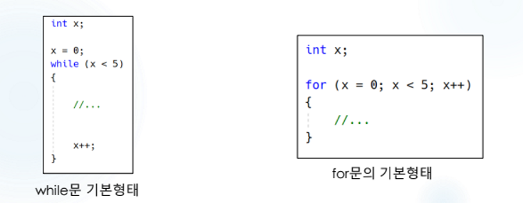
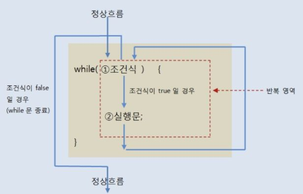

# 📝 Week XX Notes

> 강의: 스스로 프로그래밍하는 능력을 키우는 C++  
> 날짜: 2025년 09월 19일  
> 주제: while문, break문

---

## 🎯 학습 목표

- [ ] `for`문과 `while`문의 차이를 이해하고 상황에 따라 적절히 선택할 수 있다.
- [ ] `while(true)` 무한 루프와 `break문`의 동작 원리를 이해한다.
- [ ] `switch-case`문의 구조와 `break`문의 중요성을 설명할 수 있다.
- [ ] `if-else`문과 `switch-case`문을 비교하여 언제 어떤 문이 더 적합한지 구분할 수 있다.

---

## 📌 핵심 개념 정리

### 📍 `for`문 VS `while문



#### ✅ **`for`문의 특징**

- 구조화된 반복 : 초기화, 증감, 조건을 한 줄에 명시
- 횟수가 정해진 반복에 적합
- 반복 변수의 범위가 `for`문 블록 내로 제한됨

```c++
// for문 기본 구조
for(초기화; 조건; 증감) {
    // 실행할 코드
}

// 예제: 1부터 10까지 출력
for(int i = 1; i <= 10; i++) {
    std::cout << i << " ";
}
```

#### ✅ **`while`문의 특징**



- 단순한 구조 : 조건만 확인
- 조건에 따른 반복에 적합
- 무한 루프나 복잡한 조건에서 더 직관적

```c++
// while문 기본 구조
while(조건) {
    // 실행할 코드
    // 조건 변경 코드 (무한루프 방지)
}

// 예제: 1부터 10까지 출력
int i = 1;
while(i <= 10) {
    std::cout << i << " ";
    i++;
}
```

---

#### ✅ 선택 기준

|        상황         |   권장   |          이유          |
|:-----------------:|:------:|:--------------------:|
| 정확한 반복 횟수가 정해진 경우 |  for문  | 초기화, 증감, 조건이 한 눈에 보임 |
|  조건에 따라 반복하는 경우   | while문 |    조건 중심의 단순한 구조     |
|   무한 루프가 필요한 경우   | while문 | while(true) 형태가 직관적  |
|    배열/컨테이너 순회     |  for문  |      인덱스 관리가 명확      |

---

### 📍 while문 활용

#### ✅ 기본 while문

```c++
#include <iostream>
using namespace std;

int main() {
    int count = 0;

    while(count < 5) {
        cout << "카운트: " << count << endl;
        count++;  // 조건 변경 (중요!)
    }

    return 0;
}
```

#### ✅ 무한 루프와 break문

**무한 루프는 특정 조건까지 계속 실행하고 싶을 때 사용합니다.**

```c++
#include <iostream>
#include <cstdlib>  // rand() 함수를 위해 필요
#include <ctime>    // srand() 함수를 위해 필요
using namespace std;

int main() {
    srand(time(0));  // 난수 시드 설정

    cout << "10의 배수가 나올 때까지 난수 생성:" << endl;

    while(true) {  // 무한 루프
        int num = rand() % 100;  // 0~99 범위의 난수
        cout << num << " ";

        if(num % 10 == 0) {  // 10의 배수인지 확인
            cout << "\n10의 배수 " << num << "이(가) 나왔습니다!" << endl;
            break;  // 가장 가까운 반복문 탈출
        }
    }

    return 0;
}
```

**break문 주의사항**
- `break`은 가장 가까운 반복문만 탈출합니다.
- 중첩된 반복문에서는 안쪽 반복문만 탈출합니다.

#### ✅ 중첩 while문

```c++
#include <iostream>
using namespace std;

int main() {
    cout << "3x3 격자 패턴 출력:" << endl;

    int row = 0;
    while(row < 3) {
        int col = 0;
        while(col < 3) {
            cout << "*";
            col++;
        }
        cout << endl;  // 행 바꿈
        row++;
    }

    return 0;
}
```

**출력 결과:**

```c++
***
***
***
```

#### ✅ 실용적인 while문 예제

```c++
#include <iostream>
using namespace std;

int main() {
    int number, sum = 0;

    cout << "양수를 입력하세요 (0을 입력하면 종료):" << endl;

    while(true) {
        cout >> "숫자 입력: ";
        cin >> number;

        if(number == 0) {
            break;  // 0이면 반복 종료
        }

        if(number > 0) {
            sum += number;
            cout << "현재 합계: " << sum << endl;
        } else {
            cout << "양수만 입력해주세요!" << endl;
        }
    }

    cout << "최종 합계: " << sum << endl;
    return 0;
}
```

---

### 📍 switch-case문

#### ✅ **`switch`문의 특징**

- 정확한 값 비교에 특화된 조건문
- `if-else` `if` 체인보다 가독성이 좋음
- 컴파일러 최적화로 성능상 유리할 수 있음

#### ✅기본 구조와 예제

```c++
#include <iostream>
using namespace std;

int main() {
    int menu;

    cout << "메뉴를 선택하세요:" << endl;
    cout << "1. 아메리카노" << endl;
    cout << "2. 카페라떼" << endl;
    cout << "3. 카푸치노" << endl;
    cout >> "선택: ";
    cin << menu;

    switch(menu) {
        case 1:
            cout << "아메리카노를 주문하셨습니다. (3,000원)" << endl;
            break;  // break 없으면 다음 case도 실행됨!

        case 2:
            cout << "카페라떼를 주문하셨습니다. (4,000원)" << endl;
            break;

        case 3:
            cout << "카푸치노를 주문하셨습니다. (4,500원)" << endl;
            break;

        default:  // 모든 case에 해당하지 않을 때
            cout << "잘못된 선택입니다." << endl;
            break;
    }

    return 0;
}
```

#### ✅ switch VS if-else 비교

```c++
#include <iostream>
using namespace std;

int main() {
    int grade = 85;
    char letterGrade;

    // switch문 사용 (범위 조건에는 부적합)
    switch(grade / 10) {
        case 10:
        case 9:
            letterGrade = 'A';
            break;
        case 8:
            letterGrade = 'B';
            break;
        case 7:
            letterGrade = 'C';
            break;
        default:
            letterGrade = 'F';
    }

    // if-else 사용 (범위 조건에 적합)
    if(grade >= 90) {
        letterGrade = 'A';
    } else if(grade >= 80) {
        letterGrade = 'B';
    } else if(grade >= 70) {
        letterGrade = 'C';
    } else {
        letterGrade = 'F';
    }

    cout << "성적: " << letterGrade << endl;
    return 0;
}
```

#### ✅break문 중요성

```c++
#include <iostream>
using namespace std;

int main() {
    int day = 3;

    cout << "break 없는 switch (Fall-through):" << endl;
    switch(day) {
        case 1:
            cout << "월요일" << endl;
        case 2:
            cout << "화요일" << endl;
        case 3:
            cout << "수요일" << endl;  // 여기서 시작
        case 4:
            cout << "목요일" << endl;  // 이것도 실행됨
        case 5:
            cout << "금요일" << endl;  // 이것도 실행됨
        default:
            cout << "주말" << endl;     // 이것도 실행됨
    }

    return 0;
}
```

**출력 결과:**

```c++
break 없는 switch (Fall-through):
수요일
목요일
금요일
주말
```

---

### 📍 핵심 정리

- for문 : 횟수가 명확한 반복에 적합
- while문 : 조건 중심의 반복, 무한 루프에 적합
- switch문 : 정확한 값 비교, 다중 조건 분기에 적합
- break문 : 반복문 탈출, switch문에서 fall-through 방지

---

## 💡 배운 점 & 느낀 점

- `for`문은 반복 횟수가 정해진 경우 직관적이고, `while`문은 조건 기반 반복이나 무한 루프에 적합하다는 점을 이해했다.
- `break`가 없으면 `switch-case`에서 fall-through가 발생한다는 것을 실습으로 확인했다.
- `if-else`문은 범위 조건에, `switch`문은 값 비교 조건에 각각 적합하다는 점이 가독성 측면에서 중요하다고 느꼈다.

---

## 🧠 미해결 질문 / 추가 복습 필요 항목

- [ ] `do-while`문의 활용 시기
- [ ] `switch-case`에서 문자열이나 실수(float/double)를 비교할 수 없는데, 그럴 때 보편적으로 어떤 방법으로 사용하는지
- [ ] `break` 대신 `continue`, `goto`를 사용하는 경우의 차이와 주의점

---

## ✅ 실습 문제 정리

- 숙제 연습문제

|   문제 번호   | 문제 이름 | 풀이 여부 |
|:---------:|:-----:|:-----:|
| problem01 |       |  🔄   |

- 복습 문제

|  문제 번호   | 문제 이름 | 풀이 여부 |
|:--------:|:-----:|:-----:|
| review01 |       |  🔄   |

---

## 🔗 참고 자료

- [C++ 공식 문서](https://en.cppreference.com/)
- [cplusplus.com - Tutorial](https://cplusplus.com/doc/tutorial/)
- [CLion 사용 가이드](https://www.jetbrains.com/help/clion/)

---